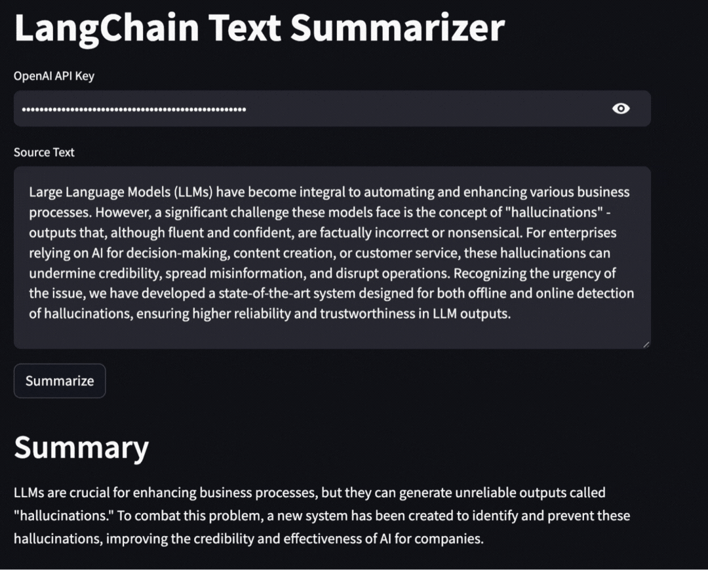

# 🎉**Welcome to Aimon Rely**

Aimon Rely is a state-of-the-art, multi-model system for detecting LLM quality issues both offline and online. Our
Hallucination detector performs well on the popular industry benchmarks. It is available via a convenient hosted API
(currently in beta).

Read our [blog post](https://aimon.ai/blogs/introducing-rely) for more details.

✨ **Join our [discord](https://discord.gg/Cp6YZ9qTdm) or reach out to us at info@aimon.ai to get your API key.**

    

## Metrics Supported

These are the quality metrics that are currently available via the API. Some of them are in progress and will be
available in a future release.

| Metric                                           | Status                                                       |
|--------------------------------------------------|--------------------------------------------------------------|
| Model Hallucination (Passage and Sentence Level) | &#10003; | 
| Semantic Similarity                              | ⌛                      |
| Completeness                                     | ⌛                      |
| Conciseness                                      | ⌛                      |
| Toxicity                                         | ⌛                      |
| Sentiment                                        | ⌛                      |
| Coherence                                        | ⌛                      |
| Sensitive Data (PII/PHI/PCI)                     | ⌛                      |

## Quick Usage

### Sandbox

You can play with a [Sandbox](https://aimon.ai/tryproduct) that is available on our website.

### API

Here is how to try the API:

- Step 1: Get your API key by requesting it on our [discord](https://discord.gg/Cp6YZ9qTdm) or sending an email
  to info@aimon.ai
- Step 2: You can try the API using either of these methods
    - [OPTION 1] Try the simple langchain summarization application that is augmented with Aimon Rely to detect
      hallucinations at the sentence level.
        - Step 1: Run `cd src`,  `pip install -r requirements.txt && python setup.py install`
        - Step 2: Make sure to add the Aimon API key to the `langchain_summarization_app.py`
        - Step 3: Run `cd ..`, `streamlit run src/examples/langchain_summarization_app.py`
    - [OPTION 2] Download the Postman collection specified below to access the API
        - Model Hallucination (Passage and Sentence
          Level): [Postman Collection](postman_collections/aimon_hallucination_detection_beta_march_2024.postman_collection.json)

✨**This GIF demonstrates a simple langchain based document summarization application that is augmented with Aimon Rely
to demonstrate the ease of integration.**

## Benchmarks

To demonstrate the effectiveness of our system, we benchmarked it against popular industry benchmarks for the
hallucination detection task. The table below shows our results.

A few key takeaways:

✅ Aimon Rely is **10x cheaper** than GPT-4 Turbo.

✅ Aimon Rely is **4x faster** than GPT-4 Turbo.

✅ Aimon Rely provides the convenience of a fully hosted API that includes baked-in explainability.

✅ Support for a context length of up to 32,000 tokens (with plans to further expand this in the near future).

Overall, Aimon Rely is 10 times cheaper, 4 times faster and close to or even **better than GPT-4** on the benchmarks
making it a suitable choice for both offline and online detection of hallucinations.

    

## Pricing

We offer a generous free tier and an attractive low cost, low latency API.

### Model Hallucination (Passage and Sentence Level)

*Only the input payload is used for pricing calculations.*

| Number of tokens           | Price per 1M tokens |
|----------------------------|---------------------|
| First 5M tokens            | **FREE**            | 
| Subsequent price/1M tokens | $1                  |

## Future Work

- We are working on additional metrics as detailed in the table above.
- In addition, we are working on something awesome to make the offline evaluation and continuous model quality
  monitoring experience more seamless.

Join our [discord](https://discord.gg/Cp6YZ9qTdm) for the latest updates and discussions on generative AI reliability.