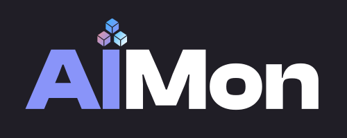
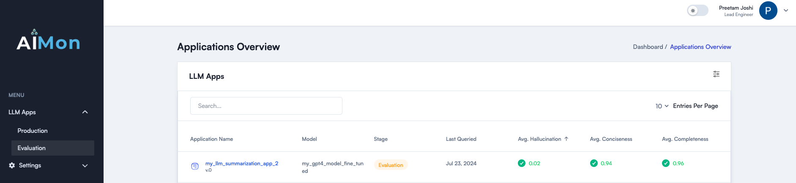
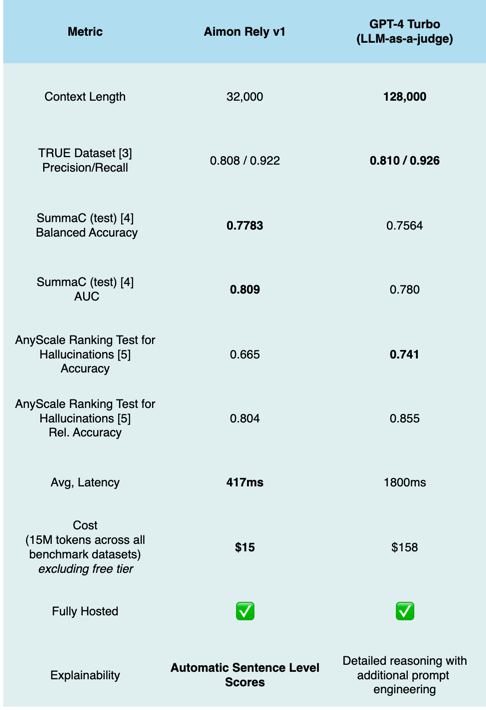

# 🎉**Welcome to AIMon Rely**

AIMon Rely helps developers build, ship, and monitor LLM Apps more confidently and reliably with its state-of-the-art, multi-model system for detecting LLM quality issues. It helps seamlessly with both offline evaluations and continuous production monitoring. AIMon Rely offers fast, reliable, and cost-effective hallucination detection. It also supports other important quality metrics such as completeness, conciseness, and toxicity. Read our [blog post](https://aimon.ai/blogs/introducing-rely) for more details.

✨ **Join our community on [Slack](https://join.slack.com/t/generativeair/shared_invite/zt-2jab62lsj-xM9a_s~Qweu8lf3YS2cANg)**

<div align="center">
    
</div>

## Metrics Supported

The following is a list of quality metrics that are currently available and on our roadmap. Please reach out to express your interest in any of these.

| Metric                                           | Status                                                       |
| ------------------------------------------------ | ------------------------------------------------------------ |
| Model Hallucination (Passage and Sentence Level) | <span style="font-size: 24px; color: green;">&#10003;</span> |
| Completeness                                     | <span style="font-size: 24px; color: green;">&#10003;</span> |
| Conciseness                                      | <span style="font-size: 24px; color: green;">&#10003;</span> |
| Toxicity                                         | <span style="font-size: 24px; color: green;">&#10003;</span> |
| Instruction Adherence                            | <span style="font-size: 24px; color: green;">&#10003;</span> |
| Semantic Similarity                              | <span style="font-size: 24px;">⌛</span>                     |
| Sentiment                                        | <span style="font-size: 24px;">⌛</span>                     |
| Coherence                                        | <span style="font-size: 24px;">⌛</span>                     |
| Sensitive Data (PII/PHI/PCI)                     | <span style="font-size: 24px;">⌛</span>                     |

## Getting Started

You can use AIMon either through an SDK or through an API. Below you will find instructions on 1. how to use the SDK along with AIMon's UI and 2. how you could use it directly through our REST APIs.

### 1. SDK and UI

AIMon supports asynchronous instrumentation or synchronous detections for the metrics mentioned above. Use these steps
to get started with using the AIMon SDK and the product.

- Step 1: Get access to the beta product by joining the waitlist on our [website](https://aimon.ai/) or by requesting
  it on [Slack](https://join.slack.com/t/generativeair/shared_invite/zt-2jab62lsj-xM9a_s~Qweu8lf3YS2cANg) or sending an email to info@aimon.ai
- Step 2: Install the AIMon SDK by running `pip install aimon` in your terminal.
- Step 3: For an axample of quick start usage

```python
from aimon import Client

API_KEY = "YOUR_API_KEY"
client = Client(auth_header=f"Bearer {API_KEY}")
data_to_send = [{
    "context": "This is the context",
    "generated_text": "This is the context",
    "config": {'hallucination': {'detector_name': 'default'}}
}]
response = client.inference.detect(body=data_to_send)[0]
```

- Step 4: For an example of how to instrument an LLM application **asynchronously** using the SDK, please refer to the [sample notebook](examples/notebooks/aimon_sdk_langchain_summarization_0_5_0.ipynb)
- Step 5: For an example of synchronous detections using the SDK, please refer to the sample [streamlit application](examples/langchain_summarization_app.py)

<div align="center">
    
</div>

### 2. API

AIMon detections can be accessed via REST APIs. Here are the steps to access the API:

- Step 1: Get your API key by requesting it on our [Slack](https://join.slack.com/t/generativeair/shared_invite/zt-2jab62lsj-xM9a_s~Qweu8lf3YS2cANg) or sending an email
  to info@aimon.ai
- Step 2: Download the [Postman Collection](examples/postman_collections) specified below to access the API

### Sandbox

You can try our [Sandbox](https://aimon.ai/tryproduct) that is available on our website to try our Hallucination detection models quickly.

## Benchmarks

### Hallucination Detection

To demonstrate the effectiveness of our system, we benchmarked it against popular industry benchmarks for the
hallucination detection task. The table below shows our results.

A few key takeaways:

✅ AIMon Rely is **10x cheaper** than GPT-4 Turbo.

✅ AIMon Rely is **4x faster** than GPT-4 Turbo.

✅ AIMon Rely provides the convenience of a fully hosted API that includes baked-in explainability.

✅ Support for a context length of up to 32,000 tokens (with plans to further expand this in the near future).

Overall, AIMon Rely is 10 times cheaper, 4 times faster, and close to or even **better than GPT-4** on the benchmarks
making it a suitable choice for both offline and online detection of hallucinations.

<div align="center">
    
</div>

### Benchmarks on other Detectors

There is a lack of industry-standard benchmark datasets for these metrics. We will be publishing an evaluation dataset soon.
Stay Tuned! <span style="font-size: 16px;">⌛</span>

## Pricing

Please reach out to info@aimon.ai for pricing details related to the product and the API.

## Future Work

- We are working on additional metrics as detailed in the table above.
- In addition, we are working on something awesome to make the offline evaluation and continuous model quality
  monitoring experience more seamless.

Join our [Slack](https://join.slack.com/t/generativeair/shared_invite/zt-2jab62lsj-xM9a_s~Qweu8lf3YS2cANg) for the latest updates and discussions on generative AI reliability.
